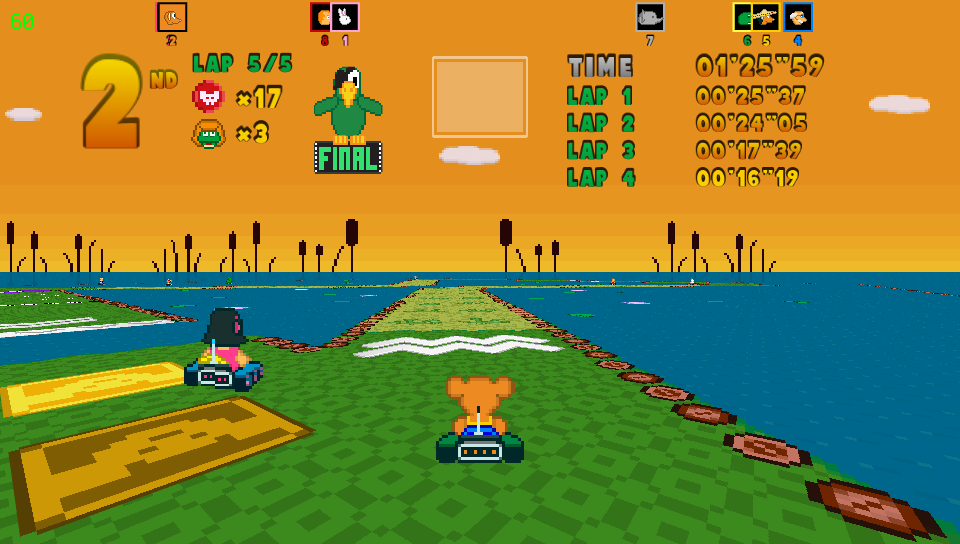

# Poppy Kart Collection

<p align="center"></p>

This is a wrapper/port of <b>Poppy Kart</b> and <b>Poppy Kart 2</b> for the *PS Vita*.

The port works by loading the official Android ARMv7 executables in memory, resolving their imports with native functions and patching them in order to properly run.
By doing so, it's basically as if we emulate a minimalist Android environment in which we run natively the executables as they are.

## Changelog

### v1.0

- Initial Release.

## Disclaimer

The game has a memleak in music freeing. Playing the game for extensive periods may cause a crash.

## Setup Instructions (For End Users)

This port supports Poppy Kart and Poppy Kart 2. <b>The instructions reported here will follow how to install Poppy Kart</b>.

In order to install Poppy Kart 2, just follow the same instructions but, when in the guide the folder `game1` is referred, change it to `game2`.

- Install [kubridge](https://github.com/TheOfficialFloW/kubridge/releases/) and [FdFix](https://github.com/TheOfficialFloW/FdFix/releases/) by copying `kubridge.skprx` and `fd_fix.skprx` to your taiHEN plugins folder (usually `ux0:tai`) and adding two entries to your `config.txt` under `*KERNEL`:
  
```
  *KERNEL
  ux0:tai/kubridge.skprx
  ux0:tai/fd_fix.skprx
```

**Note** Don't install fd_fix.skprx if you're using rePatch plugin

- **Optional**: Install [PSVshell](https://github.com/Electry/PSVshell/releases) to overclock your device to 500Mhz.
- Install `libshacccg.suprx`, if you don't have it already, by following [this guide](https://samilops2.gitbook.io/vita-troubleshooting-guide/shader-compiler/extract-libshacccg.suprx).
- Obtain your copy of *Poppy Kart* legally for Android in form of an `.apk` file. [You can get all the required files directly from your phone](https://stackoverflow.com/questions/11012976/how-do-i-get-the-apk-of-an-installed-app-without-root-access) or by using an apk extractor you can find in the play store. The apk can be extracted with whatever Zip extractor you prefer (eg: WinZip, WinRar, etc...) since apk is basically a zip file. You can rename `.apk` to `.zip` to open them with your default zip extractor.
- Open the apk with your zip explorer and extract the file `libmain.so` from the `lib/armeabi-v7a` folder to `ux0:data/poppykart/game1`.
- Extract the `assets` folder inside `ux0:data/poppykart/game1`.

## Full game support

Full game mode for both games can be enabled by editing a config file named `settings.cfg` located inside `ux0:app/POPPYKART`.
We strongly encourage to enable support for these contents solely if you purchased them on your Android device.
Sadly, we have no way to propose a license check on Vita against your purchased in-game contents on Android, so show respect and support *webrox* first before proceeding.
Open the file `ux0:app/POPPYKART/settings.cfg` and change `enable_dlcs=0` to `enable_dlcs=1`.

## Build Instructions (For Developers)

In order to build the loader, you'll need a [vitasdk](https://github.com/vitasdk) build fully compiled with softfp usage.  
You can find a precompiled version here: https://github.com/vitasdk/buildscripts/actions/runs/1102643776.  
Additionally, you'll need these libraries to be compiled as well with `-mfloat-abi=softfp` added to their CFLAGS:

- [SDL2_vitagl](https://github.com/Northfear/SDL/tree/vitagl)

- [libmathneon](https://github.com/Rinnegatamante/math-neon)

  - ```bash
    make install
    ```

- [vitaShaRK](https://github.com/Rinnegatamante/vitaShaRK)

  - ```bash
    make install
    ```

- [kubridge](https://github.com/TheOfficialFloW/kubridge)

  - ```bash
    mkdir build && cd build
    cmake .. && make install
    ```

- [vitaGL](https://github.com/Rinnegatamante/vitaGL)

  - ````bash
    make SOFTFP_ABI=1 NO_DEBUG=1 install
    ````

After all these requirements are met, you can compile the loader with the following commands:

```bash
mkdir build && cd build
cmake .. && make
```

## Credits

- TheFloW for the original .so loader.
- CatoTheYounger for the screenshots and for testing the homebrew.
- Northfear for the SDL2 fork with vitaGL as backend.
